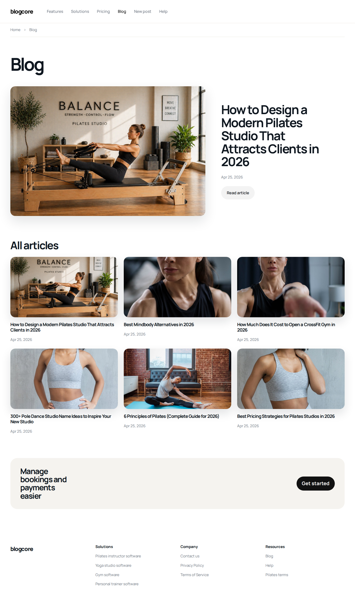
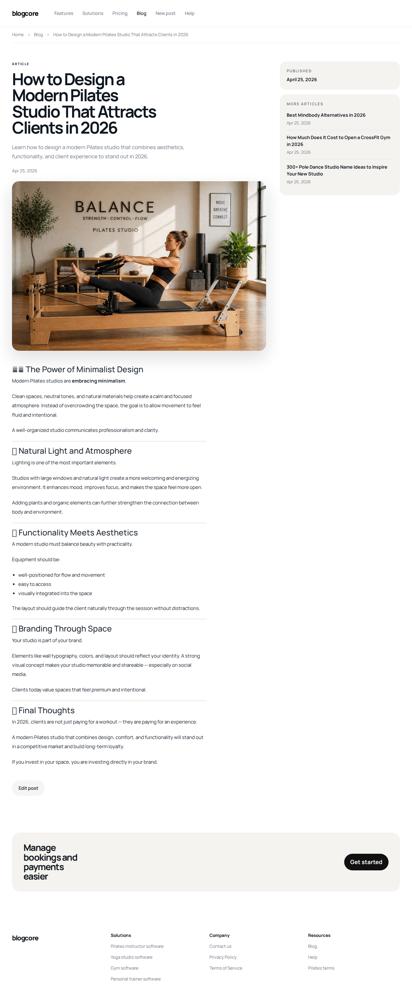
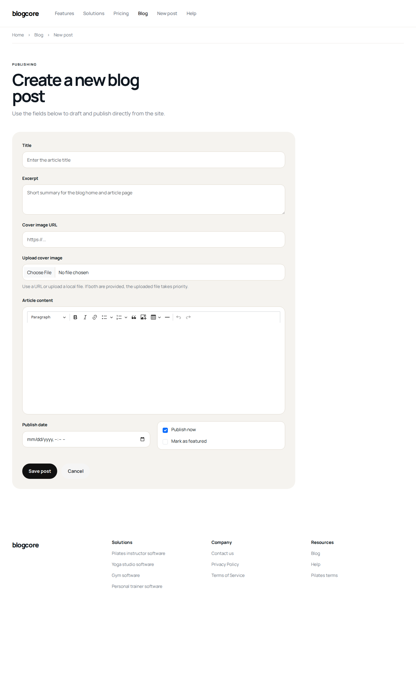

# BlogCore

BlogCore is a Django editorial blog project built as a portfolio-grade application.
It combines a custom frontend, a publishing workflow, rich text authoring, and a modular backend structure inspired by the architecture used in `curso-django-2.0`.

## Overview

This project was designed to simulate a real content platform instead of a basic CRUD demo.
The goal was to build a blog with:

- an editorial homepage inspired by modern SaaS/blog layouts
- article detail pages with rich content support
- post creation and editing directly from the website
- image upload support inside article content
- cover images by external URL or local upload
- modular Django architecture with app-level organization
- a facade layer for domain queries
- automated tests and CI

## Main Features

- Editorial homepage with featured article and article grid
- Article detail page with related content and consistent shared layout
- Rich text authoring with `CKEditor 5`
- Inline image upload inside article body
- Cover image support via URL or uploaded file
- Post creation flow from the public site
- Post editing flow from the article page
- Django admin configured for editorial management
- Environment-based settings for development and production
- GitHub Actions CI for lint and tests

## Screenshots

### Homepage



### Article Detail



### Post Editor



## Architecture

The project follows a modular Django structure:

```text
apps/
└── blog/
    ├── facade.py
    ├── forms.py
    ├── models.py
    ├── urls.py
    ├── views.py
    ├── templates/blog/
    ├── static/blog/
    └── tests/

config/
├── urls.py
└── settings/
    ├── base.py
    ├── development.py
    └── production.py
```

### Facade Pattern

Following the `curso-django-2.0` reference project, the app uses a `facade.py` file to centralize domain queries such as:

- listing published posts
- finding the featured article
- finding a published article by slug
- listing related articles

This keeps views thin and focused on HTTP flow, template rendering, forms, redirects, and messages.

## Stack

- Python 3.12
- Django 6
- Bootstrap 5.3.8
- CKEditor 5
- Pytest
- Pytest-Django
- Ruff
- WhiteNoise
- uv

## Editorial Workflow

Posts can be managed in two ways:

1. Django admin
2. Website publishing form

The website form supports:

- title
- excerpt
- cover image URL
- cover image upload
- article body with rich text formatting
- inline image upload in the content editor
- publish date
- publish status
- featured status

## Quality and Validation

The project includes:

- unit and integration tests for views, models, urls, admin, and facade
- linting with Ruff
- Django system checks
- CI workflow for automated validation

Current test status at the end of this iteration:

- `43` tests passing
- `94%` coverage in the main blog application and project configuration targets

## Local Setup

Install dependencies:

```bash
uv sync --all-groups
```

Apply migrations:

```bash
python manage.py migrate
```

Run the development server:

```bash
python manage.py runserver
```

Run tests:

```bash
python -m pytest apps/blog/tests
```

Run lint:

```bash
./.venv/bin/ruff check .
```

## Portfolio Value

This project demonstrates:

- backend architecture decisions beyond basic Django defaults
- UI implementation from visual references
- editorial content modeling
- form flows for creation and editing
- rich text integration with media upload
- test discipline
- CI setup and environment separation

It is a strong example of a Django project that moves beyond tutorial-level scaffolding and into a more realistic product-oriented implementation.
